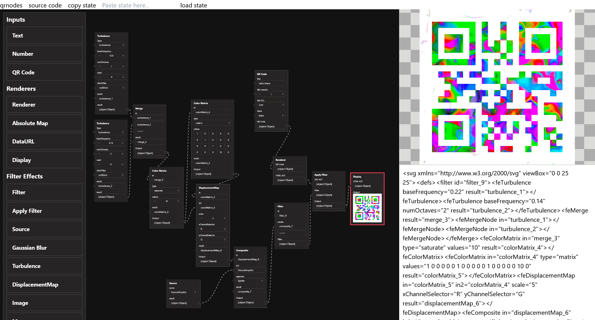

# qrnodes

node-based editor for QR codes

## Todo

- text selected by select box in chrome (preventDefault breaks input focus events)

## Inspiration

- https://svgfm.chriskirknielsen.com/
- https://poletaevvlad.github.io/svg-filter-editor/
- https://yoksel.github.io/svg-filters/
- https://svg.wtf/
- https://svg-shaders.vercel.app/
